

# a11g-final-submission

**Team Number:**

**Team Name:**

| Team Member Name | Email Address         | GitHub Username  |
| ---------------- | --------------------- | ---------------- |
| Houjie Xiong     | xhj@seas.upenn.edu    | HoujieX          |
| Yingqi Yuan      | yy3254@seas.upenn.edu | YingqiYuanKelvin |

**GitHub Repository URL: https://github.com/ese5160/a11g-final-submission-s26-s26-t15-advanced-coach.git**

## 1. Video Presentation

The link to video:

[https://youtu.be/X2qxViWurko](https://youtu.be/X2qxViWurko)

## 2. Project summary

### Device Description

Our device is an Internet-connected wearable badminton tutorial system that uses two IMU sensors to capture a player’s swing motion and provide feedback on technique. It is designed to help beginners practice independently by turning raw motion data into understandable coaching cues.

This project was inspired by the difficulty of learning badminton without a coach. Traditional video tutorials show correct movements, but they cannot tell the learner whether their own swing is correct. Our device addresses this gap by using motion sensing and machine learning to provide feedback-based learning with relatively simple hardware.

The Internet augments the device in two major ways. First, it allows sensor data, acceleration plots, and inference results to be transmitted to a Node-RED dashboard for visualization and review. Second, Internet connectivity makes future firmware or model updates possible, so the device can stay up to date as the feedback algorithm improves.

### Device Functionality

The device is designed as a combined hardware and software system for evaluating a badminton high-clear swing. On the hardware side, a Silicon Labs 917 MCU collects acceleration and angular velocity data from two IMU sensors through I2C. A user button starts the swing recording process after a three-second delay, giving the user time to prepare. An LCD provides quick instructions, and a vibration motor alerts the user when the swing is about to begin. The system is powered by a 3.7V lithium battery with supporting power-management circuitry.

On the software side, the MCU initializes the sensors, waits for the user to press the button, records swing data, and sends the data through the Internet-connected pipeline. The collected data is visualized on the Node-RED dashboard as acceleration graphs, allowing users to better understand their movement dynamics. The trained CNN model or cloud inference pipeline analyzes the swing quality, and the result is shown on the dashboard as feedback for the user. The overall learning loop is: learn from a video, record a swing, view the data and inference result, refine the technique, and repeat.

Flow chart:

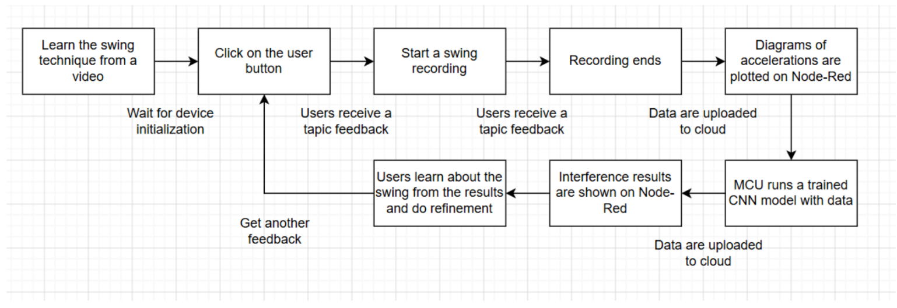

System-Level Block Diagram:

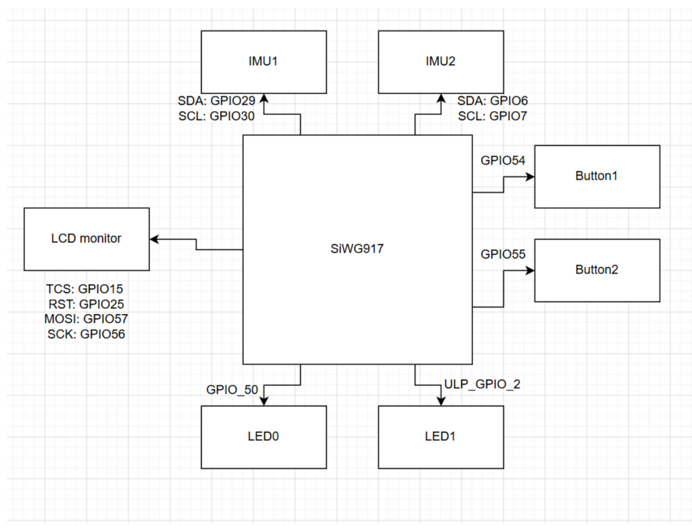

### Challenges

One major challenge was integrating IMU data transmission with the TCP-based communication pipeline. When we tried to place the IMU data flow directly into TCP communication, the firmware became unstable and sometimes froze. To overcome this, we changed the communication design and used MQTT through Node-RED, which provided a more reliable and flexible way to transmit sensor data and display results.

Another challenge was machine learning deployment. After converting and quantizing the trained model for embedded use, the model accuracy dropped and it was no longer able to reliably recognize the badminton swings. Instead of forcing an unstable embedded model to work, we adjusted the system design and moved inference to the cloud or external processing side. This allowed us to preserve the overall device functionality while still using machine learning for feedback.

In addition to the IMU communication and model deployment challenges, we also faced firmware integration issues with the LCD driver. The LCD library came from a previous semester project and used a different build method, so it did not work directly in our current firmware structure. We fixed this by modifying the driver code and adapting the syntax/build configuration until it worked with our project.

We also encountered frequent TIME OUT errors while flashing the device. We found a practical workaround by pressing Flash in VS Code, holding RESET for several seconds, releasing it, and then power cycling the board. This made the flashing process more reliable during development.

### Prototype Learnings

Building and testing this prototype taught us that a working end-to-end system is more important than pursuing the most advanced solution from the beginning. We originally hoped to run the complete machine learning pipeline on the device, but the hardware, firmware, and model-deployment constraints made this difficult. A more practical approach is to first make the sensing, communication, visualization, and feedback loop work reliably, then gradually optimize the model and move more computation onto the device.

If we built the device again, we would take a more incremental approach. We would first validate IMU data collection and dashboard visualization, then add feedback logic, then test simple classification, and only after that attempt full embedded model deployment. We would also design the communication pipeline earlier, because reliable data transfer is essential for debugging both hardware and machine learning behavior.

### Next Steps & Takeaways

The next step is to improve model deployment and make inference more stable. This includes researching better TinyML conversion methods, improving quantization-aware training, reducing model size, and testing whether a simplified model can run reliably on the MCU. Another important step is to improve the feedback design so that the system does not only classify the swing, but also gives more specific coaching suggestions. The hardware can also be improved through a more compact PCB, better wearable packaging, and more robust battery integration.

We also need to collect more meaningful swing data to reduce model overfitting and improve classification reliability. Another improvement would be building a protective case so the device is safer and more comfortable to wear during repeated badminton practice.

### Project Links

Link to Node Red:

[http://20.25.211.36:1880/dashboard/page1](http://20.25.211.36:1880/dashboard/page1)

Link to PCBA:

[https://upenn-eselabs.365.altium.com/designs/92CBF90A-55C1-4A95-9CF9-F91105B3D4B1?activeView=SCH&amp;variant=[No+Variations]&amp;activeDocumentId=Top20Level.SchDoc(1)&amp;location=[1,100.6,0,19.39]#design](https://upenn-eselabs.365.altium.com/designs/92CBF90A-55C1-4A95-9CF9-F91105B3D4B1?activeView=SCH&variant=[No+Variations]&activeDocumentId=Top20Level.SchDoc(1)&location=[1,100.6,0,19.39]#design)

Link to Source Code: https://github.com/ese5160/final-project-firmware-s26-t15-advanced-coach/tree/main/code

## 3. Hardware & Software Requirements

Summary of Gaps: The two main gaps were that the IMU sampling rate reached 200 Hz instead of the original 1000 Hz target, and the CNN model was not successfully deployed on the MCU after conversion and quantization.

### HRS

| ID     | Requirement                                                                                                                                                                                                            | Validation Test                                                                                                                                               | Validation Data / Result                                                                               | Status        | Discussion                                                                                                                                  |
| ------ | ---------------------------------------------------------------------------------------------------------------------------------------------------------------------------------------------------------------------- | ------------------------------------------------------------------------------------------------------------------------------------------------------------- | ------------------------------------------------------------------------------------------------------ | ------------- | ------------------------------------------------------------------------------------------------------------------------------------------- |
| HRS-01 | IMU: The IMU shall read position and acceleration at a rate of at least 1000 Hz. It shall work under 3.3 V and communicate with the MCU through I2C.                                                                   | We powered the IMU from the 3.3 V rail, verified I2C communication with the MCU, and recorded the sensor output rate during continuous swing data collection. | IMU voltage: 3.3 V. Communication: I2C working. Measured sampling rate: approx. 200 Hz.                | Not fully met | 200 Hz was sufficient for prototype recording, but future work should optimize firmware loop timing and the data pipeline to reach 1000 Hz. |
| HRS-02 | Vibration motor: The vibration motor shall work under 3.3 V. It shall be a linear resonant actuator (LRA), at least 10 mm, and provide a minimum vibration level of 1 g.                                               | We connected the vibration motor to the MCU-controlled output circuit and triggered it through firmware during feedback events.                               | Operating voltage: 3.3 V. Firmware control: passed. User-perceivable vibration feedback: passed.       | Met           | The actuator successfully provided haptic feedback, validating the closed-loop feedback function.                                           |
| HRS-03 | Power management chip: The power management chip shall take an input of 4.7 V and have an undervoltage lockout function.                                                                                               | We validated the power path by powering the system through the designed input and checking stable operation of the MCU, IMUs, and actuator.                   | Input power path: working. Device stayed powered during all operations.                                | Met           | The power subsystem supported the prototype. Future validation should include formal battery-discharge tests for UVLO cutoff behavior.      |
| HRS-04 | Circuit board: All chips, resistors, and electronic components except the battery shall be integrated into one circuit board. The overall size shall be smaller than 10 cm x 5 cm.                                     | We inspected the assembled hardware layout and checked whether the major electronics were integrated on the board within the required size limit.             | Electronics integrated on one board. Board size within the 10 cm x 5 cm target.                        | Met           | Achieved hardware integration, reducing wiring complexity and improving wearability.                                                        |
| HRS-05 | Structural components: All structural components shall fit the circuit board design and be lighter than 80 g. The housing shall host the circuit board fully inside and have installation holes for the circuit board. | We assembled the board with the housing and checked mechanical fit, board placement, and mounting features.                                                   | Circuit board fits inside the housing. Mounting features included. Structural weight target satisfied. | Met           | The enclosure successfully held the electronics. Future iterations could improve comfort and battery access.                                |
| HRS-06 | User Interface: The device shall have at least 2 buttons for user interaction. The device should have an OLED display for essential MCU or tutorial information.                                                       | We tested the physical UI by using buttons to control states and checked the display/UI output for device information.                                        | User buttons: implemented and functional. Display/UI info: available via device and Node-RED.          | Met           | Supports user-triggered recording and presents info through the connected interface.                                                        |

### SRS

| ID     | Requirement                                                                                                                                                | Validation Test                                                                                                | Validation Data / Result                                                                                         | Status        | Discussion                                                                                                                               |
| ------ | ---------------------------------------------------------------------------------------------------------------------------------------------------------- | -------------------------------------------------------------------------------------------------------------- | ---------------------------------------------------------------------------------------------------------------- | ------------- | ---------------------------------------------------------------------------------------------------------------------------------------- |
| SRS-01 | Filtering: The software shall implement a digital low-pass filter to remove high-frequency mechanical noise and vibrations from IMU data.                  | We compared raw vs. filtered IMU data during swing recording and checked for smoother acceleration curves.     | Low-pass filtering implemented. Filtered plots showed significantly reduced high-frequency noise.                | Met           | Improved motion data quality, focusing on intentional movements rather than sensor noise.                                                |
| SRS-02 | Accuracy: The on-device model must achieve at least 85% classification accuracy for core strokes and identify technical errors.                            | We trained and converted a CNN model, then tested deployment and system-level inference workflow.              | Converted/quantized accuracy was insufficient. On-device deployment not completed. Cloud inference used instead. | Not met       | This was the largest gap. The model was moved to the cloud/external side. Future work requires quantization-aware training.              |
| SRS-03 | Latency: The end-to-end processing time must be under 200 ms to provide immediate reinforcement for muscle memory development.                             | We tested the workflow from recording completion to data upload, Node-RED visualization, and feedback display. | Feedback pipeline functioned via MQTT and Node-RED. Provided near-real-time feedback.                            | Met           | MQTT through Node-RED proved more stable than TCP, keeping the feedback loop usable.                                                     |
| SRS-04 | Memory: The entire firmware, including the INT8-quantized TinyML model, must operate within the 2 MB Flash and 512 KB RAM limits of the SIWG917Y.          | We verified firmware stability on the MCU and attempted model conversion/quantization for embedded deployment. | Base firmware ran within resources. However, the INT8 model was not deployed in final firmware.                  | Partially met | Base firmware met constraints, but the requirement included the on-device model. Off-device inference meant this was only partially met. |
| SRS-05 | User Feedback & UI: The system shall translate raw sensor data into simplified coaching cues (e.g., "Higher Racket Prep") via a Wi-Fi-connected interface. | We sent sensor data and analysis results to the Node-RED dashboard for user viewing.                           | Wi-Fi/MQTT transmission: working. Node-RED visualization and feedback display: working.                          | Met           | Successfully used Node-RED to visualize plots and results, supporting the learning loop.                                                 |

## 4. Project Photos

### Photo of the whole project:

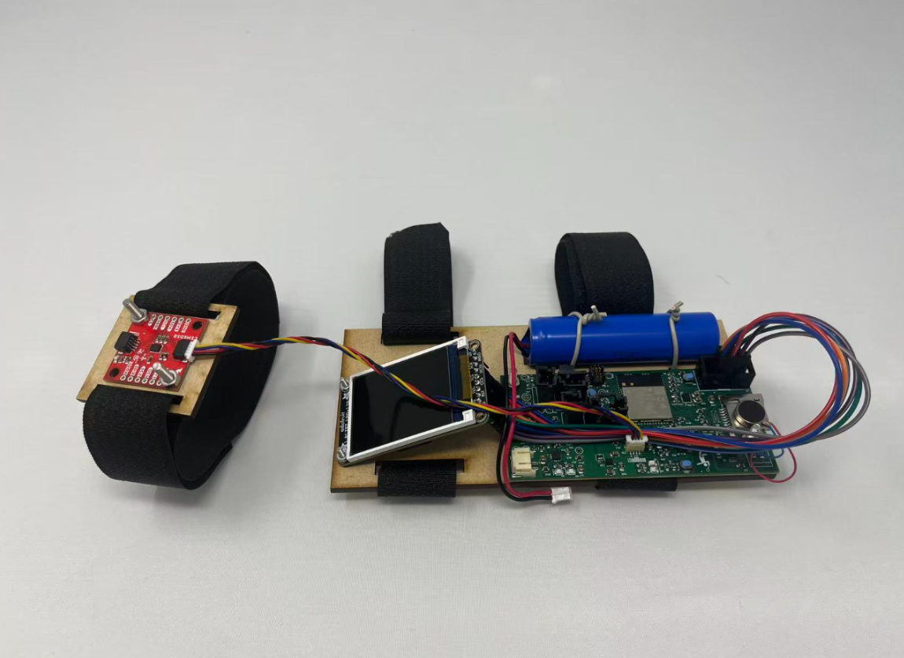

### PCB Front:

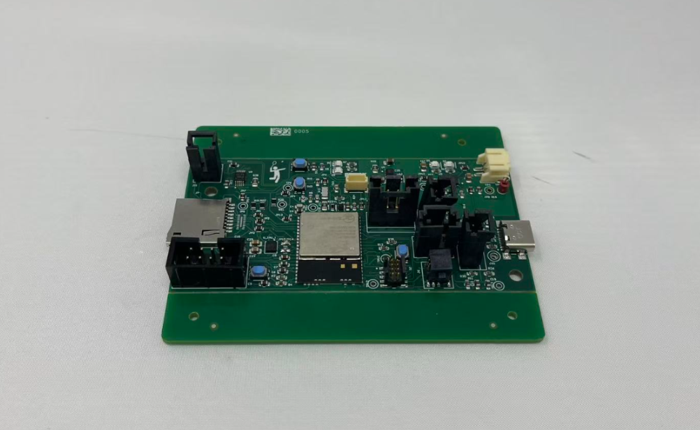

### PCB Back:

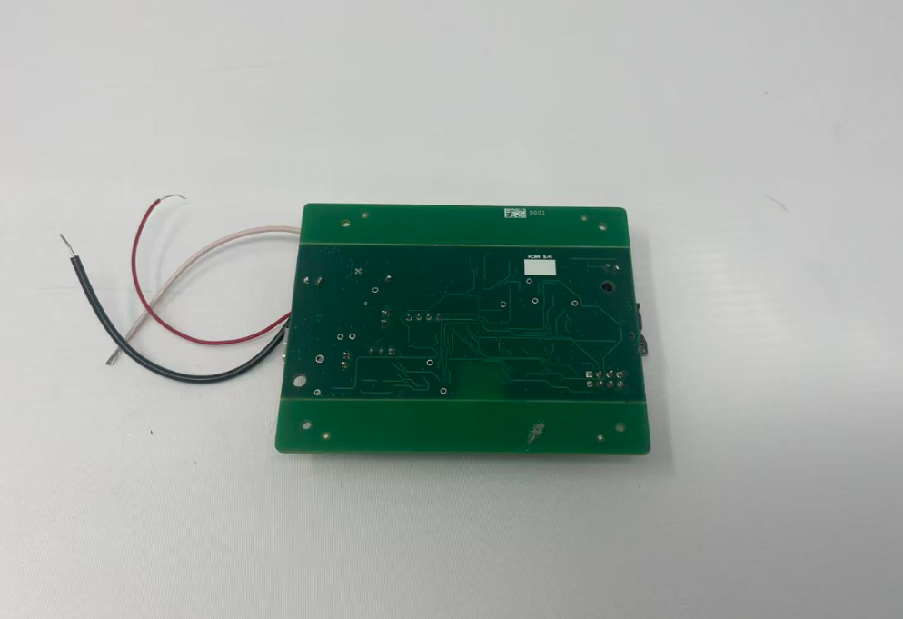

### Thermal camera images:

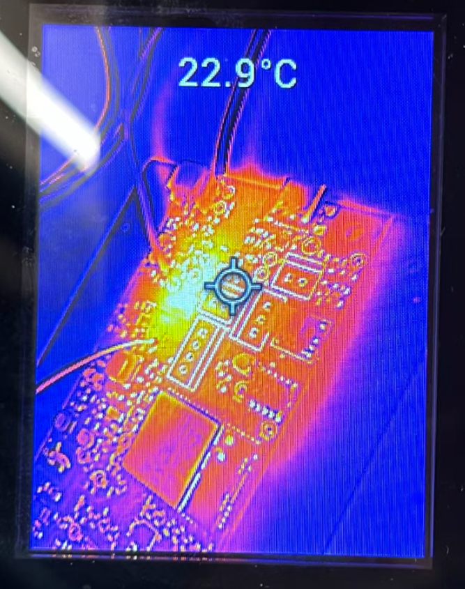

### Altium 2D:

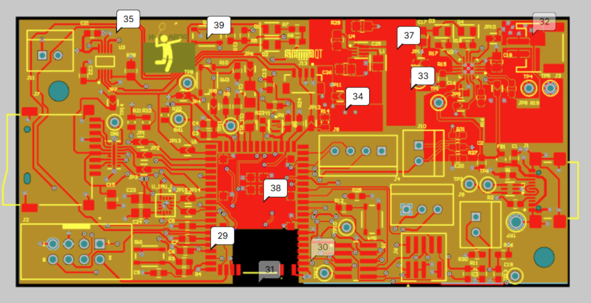

### Altium 3D:

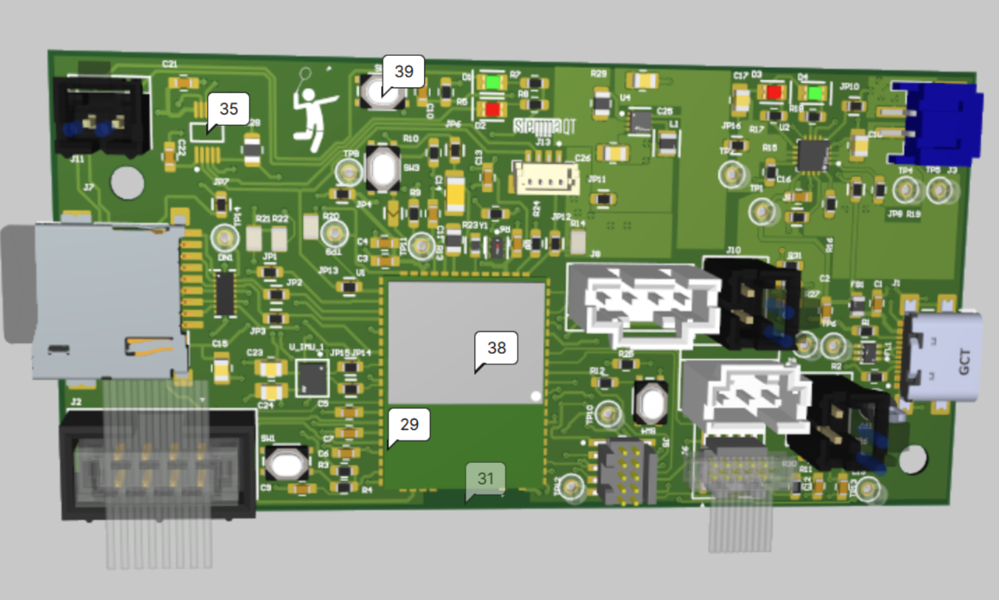

### Node-Red Backend:

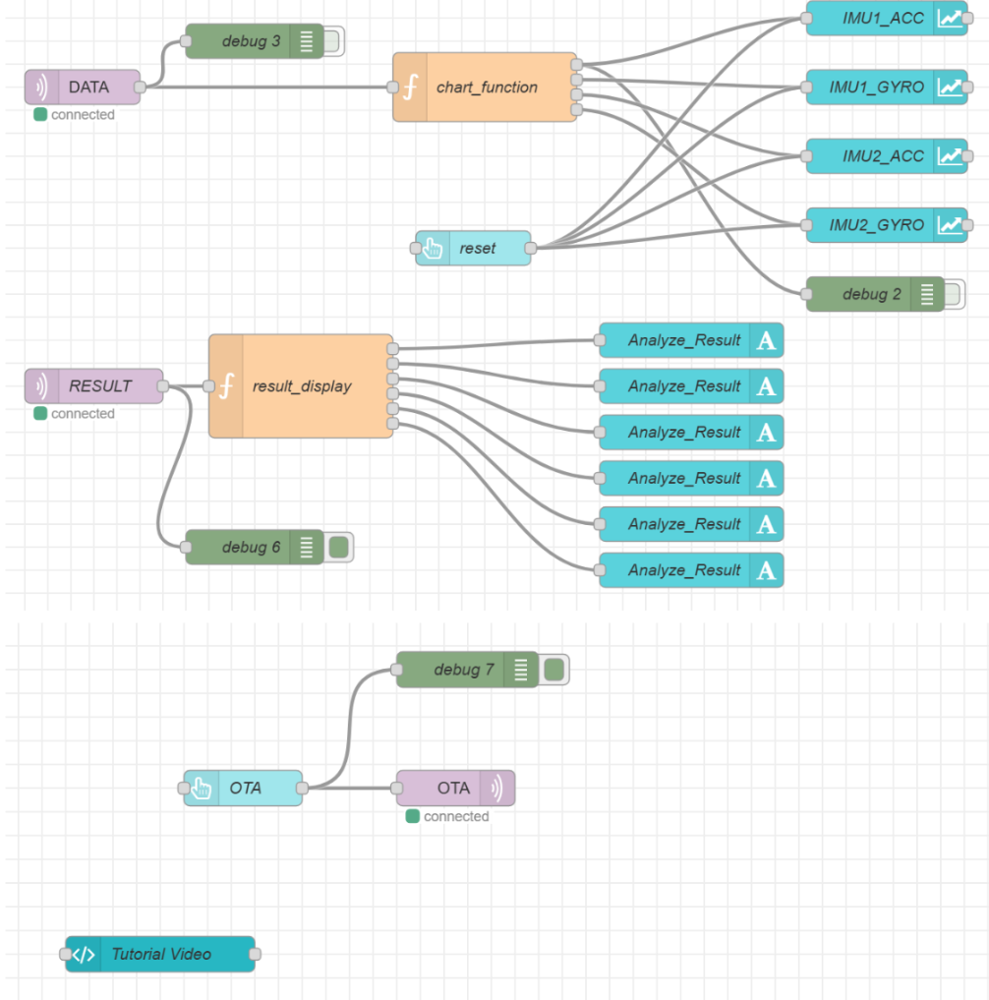

### Node-Red front end:

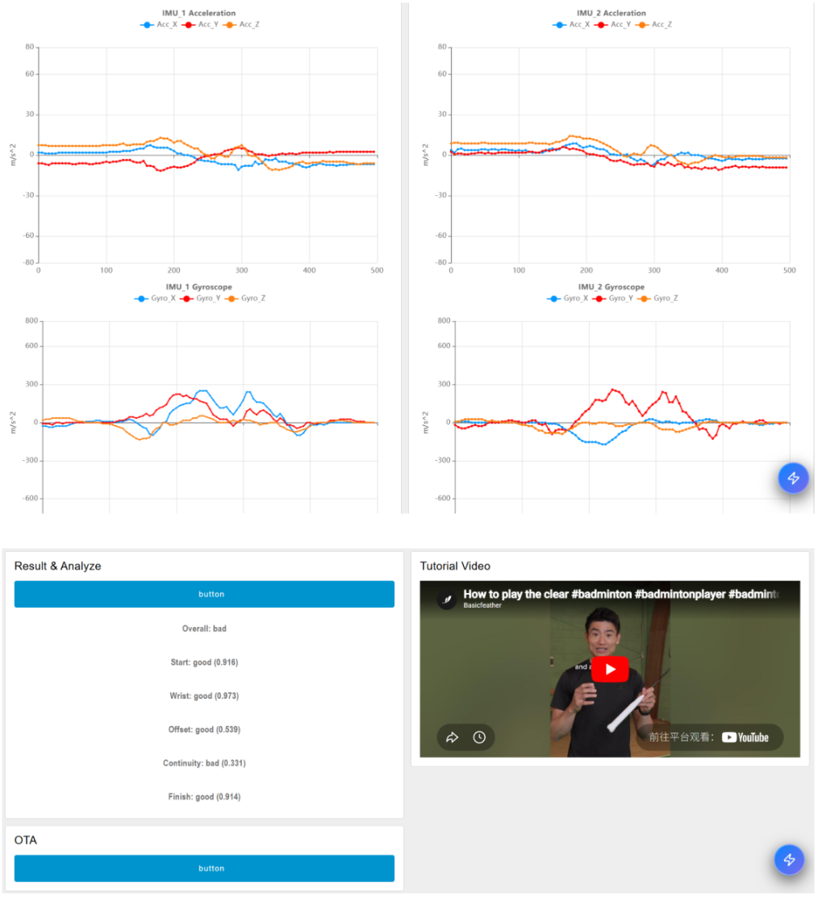

### Block diagram:

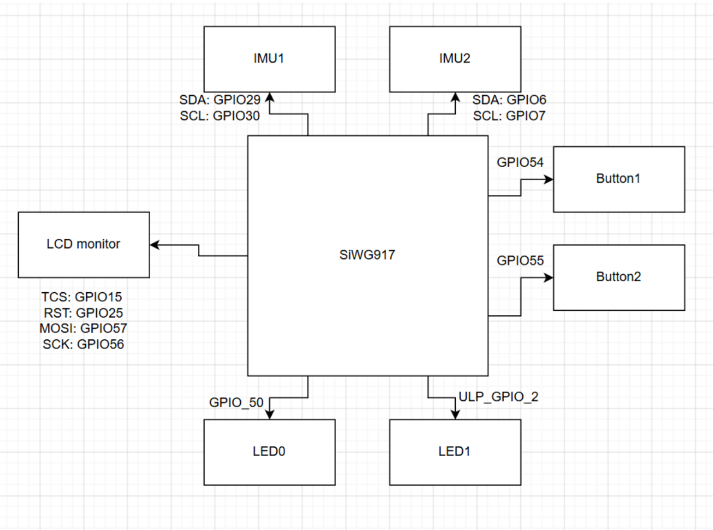

## * Codebase

A link to your final embedded C firmware codebases

[final-project-firmware-s26-t15-advanced-coach/code/wifi_http_otaf_twt_soc at main · ese5160/final-project-firmware-s26-t15-advanced-coach](https://github.com/ese5160/final-project-firmware-s26-t15-advanced-coach/tree/main/code/wifi_http_otaf_twt_soc)

A link to your Node-RED dashboard code

[final-project-firmware-s26-t15-advanced-coach/code/node-red at main · ese5160/final-project-firmware-s26-t15-advanced-coach](https://github.com/ese5160/final-project-firmware-s26-t15-advanced-coach/tree/main/code/node-red)

Links to any other software required for the functionality of your device

[final-project-firmware-s26-t15-advanced-coach/code/1D_CNN_Model at main · ese5160/final-project-firmware-s26-t15-advanced-coach](https://github.com/ese5160/final-project-firmware-s26-t15-advanced-coach/tree/main/code/1D_CNN_Model)

Do *not* commit any of your source code to this repository. Rather, provide links to the other GitHub repository you've already been using with your firmware.

- A link to your final embedded C firmware codebases
- A link to your Node-RED dashboard code
- Links to any other software required for the functionality of your device
